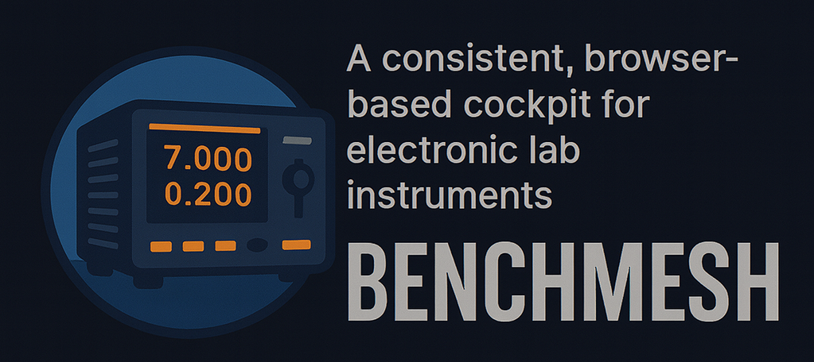

# BenchMesh


A consistent, browser-based cockpit for lab instruments; connect, control, log, correlate, and automate from one place.


Below are two Mermaid diagrams describing the current structure and behavior. Paste them into any Mermaid-compatible renderer (e.g., GitHub) to visualize.

## Architecture diagram

```mermaid
graph TD
  A[config.yaml] -->|devices list| B[SerialManager]
  subgraph API
    C[FastAPI app]
    C1[/GET /status/]
    C2[/GET /instruments/]
  end
  C1 --> C
  C2 --> C
  C -->|queries state| B

  subgraph SerialManager internals
    B1[connections: {id -> driver}]
    B2[registry: {id -> {IDN, status}}]
    B3[dev_locks: {id -> RLock}]
    B4[dev_threads: {id -> Thread}]
    B5[last_probe, last_open_attempt, last_ok]
  end
  B --> B1
  B --> B2
  B --> B3
  B --> B4
  B --> B5

  subgraph Drivers
    D1[TenmaPSU]
    D2[OWON SPM]
    D3[OWON XDM]
    D4[OWON OEL]
  end

  B1 --> D1
  B1 --> D2
  B1 --> D3
  B1 --> D4

  subgraph Transport
    T1[SerialTransport]
    T2[pyserial.Serial]
  end
  D1 --> T1
  D2 --> T1
  D3 --> T1
  D4 --> T1
  T1 --> T2
  T2 -->|/dev/ttyUSBx etc| OS[(OS serial ports)]

  style B fill:#eef,stroke:#66f
  style C fill:#efe,stroke:#2a2
  style D1 fill:#ffe,stroke:#aa0
  style D2 fill:#ffe,stroke:#aa0
  style D3 fill:#ffe,stroke:#aa0
  style D4 fill:#ffe,stroke:#aa0
  style T1 fill:#fef,stroke:#a2a
  style T2 fill:#fef,stroke:#a2a
```

## Behavior (per-device worker)

```mermaid
sequenceDiagram
  participant Main as main.py
  participant SM as SerialManager
  participant WT as WorkerThread(dev-id)
  participant D as Driver (e.g., TenmaPSU)
  participant ST as SerialTransport

  Main->>SM: start()
  SM->>WT: spawn per-device thread
  WT->>SM: reconnect(dev)
  SM->>D: instantiate driver (from manifest/config)
  D->>ST: open()
  Note right of D: On (re)connect only:
  D->>D: identify() -> "*IDN?"
  D->>ST: write_line('*IDN?')
  ST-->>D: read_until_reol() -> IDN
  D-->>SM: IDN
  SM->>SM: registry[id]['IDN'] = IDN

  loop Every ~2 seconds
    WT->>D: poll_status()
    alt TenmaPSU
      D->>D: read_output_voltage(); read_output_current(); read_status()
    else Others (placeholder)
      D->>D: return {"A":"B"}
    end
    D-->>WT: status JSON
    WT->>SM: registry[id]['status'] = status
  end

  Note over SM: Every ~5s: DEBUG log registry snapshot

  alt poll error
    WT->>D: poll_status() raises
    WT->>D: close()
    WT->>SM: connections[id] = None; last_open_attempt = now
    Note over WT: Reconnect attempts every ~2s while disconnected
  end
```

## Registry data model (conceptual)
- registry: dict keyed by device id from config.yaml
  - registry[device_id]["IDN"] -> str from identify() on connect/reconnect
  - registry[device_id]["status"] -> JSON object from poll_status() every ~2s

## Notes
- FastAPI exposes:
  - GET [/status](benchmesh-serial-service/src/benchmesh_service/api.py): summary counts of connected/disconnected
  - GET [/instruments](benchmesh-serial-service/src/benchmesh_service/api.py): list of {id, IDN} and classes
- Drivers:
  - TenmaPSU.poll_status builds a composite JSON from read_output_voltage, read_output_current, read_status
  - OWON drivers currently return a placeholder {"A":"B"}; can be extended later
- Concurrency:
  - One worker thread per device, protected by per-device RLock
  - Reconnect backoff: ~2s between attempts per device

If you’d like, we can export these to PlantUML or generate SVG/PNG artifacts, or embed the diagrams into the repo (e.g., docs/architecture.md).

## Manual driver testing (CLI)
The repository includes a small CLI to manually test driver methods while honoring config.yaml and manifests.

- Module: benchmesh_service.tools.driver_cli
- Location: [benchmesh-serial-service/src/benchmesh_service/tools/driver_cli.py](benchmesh-serial-service/src/benchmesh_service/tools/driver_cli.py)

### Usage
- Ensure you run commands from repo root so Python can resolve benchmesh_service from benchmesh-serial-service/src.
- If needed, set PYTHONPATH=benchmesh-serial-service/src

### Examples
- List devices from config.yaml:
  ```bash
  python -m benchmesh_service.tools.driver_cli list --config config.yaml
  ```

- List available methods for a device (by id):
  ```bash
  python -m benchmesh_service.tools.driver_cli methods --id tenmapsu-1 --config config.yaml
  ```

- Call a method without args:
  ```bash
  python -m benchmesh_service.tools.driver_cli call --id tenmapsu-1 --method identify --config config.yaml
  ```

- Call a method with positional args (auto-coerced int/float/bool):
  ```bash
  python -m benchmesh_service.tools.driver_cli call --id spm-1 --method set_voltage 5.0 --config config.yaml
  ```

- Call a method with kwargs (JSON object):
  ```bash
  python -m benchmesh_service.tools.driver_cli call --id tenmapsu-1 --method set_output true --kwargs '{"ch":1}' --config config.yaml
  ```

Other examples:
- ```bash
  python -m benchmesh_service.tools.driver_cli call --id tenmapsu-1 --method identify --config config.yaml
  ```
- ```bash
  python -m benchmesh_service.tools.driver_cli call --id tenmapsu-1 --method read_status --config config.yaml
  ```
- ```bash
  python -m benchmesh_service.tools.driver_cli call --id tenmapsu-1 --method set_output --config config.yaml true
  ```
- ```bash
  python -m benchmesh_service.tools.driver_cli call --id spm-1 --method poll_status --config config.yaml
  ```
- ```bash
  python -m benchmesh_service.tools.driver_cli call --id some-id --method set_voltage 5.0 --kwargs '{"ch":1}' --config config.yaml
  ```

Notes
- Only the targeted device is instantiated to keep testing isolated.
- Results are printed as JSON when the return type is a collection; otherwise as text.
- Bytes responses are decoded to text when possible.

