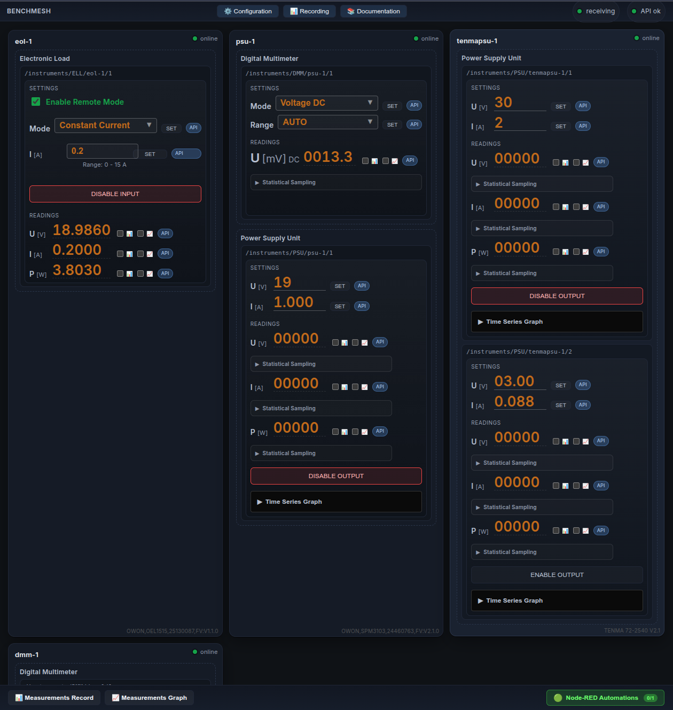
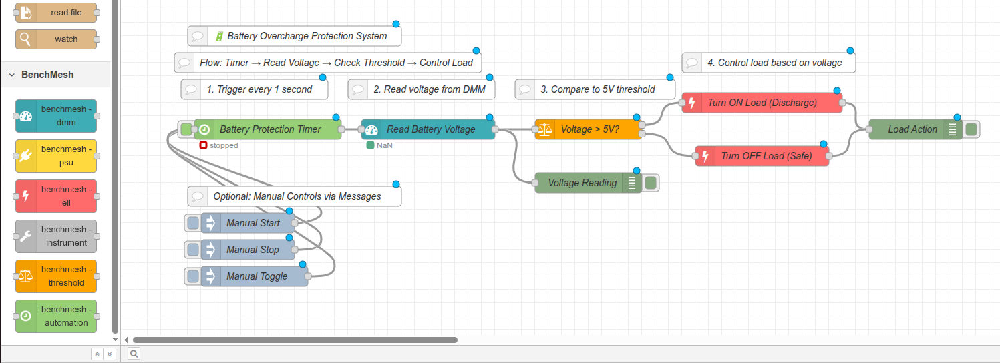

<div align="center">


# BenchMesh

**A consistent, browser-based cockpit for lab instruments**

Connect, control, log, correlate, and automate multiple serial devices from one place.

[](https://opensource.org/licenses/MIT)
[](https://www.python.org/downloads/)
[](https://nodejs.org/)
[](https://github.com/MarkoVcode/BenchMesh/actions)
[](https://github.com/MarkoVcode/BenchMesh/issues)
[](https://github.com/MarkoVcode/BenchMesh/stargazers)

[Documentation](docs/Home.md) • [Getting Started](docs/Getting-Started.md) • [API Reference](docs/API-Reference.md) • [Contributing](CONTRIBUTING.md)

</div>

---

## Table of Contents

- [About](#about)
- [Features](#features)
- [Supported Devices](#supported-devices)
- [Quick Start](#quick-start)
- [Usage](#usage)
- [Architecture](#architecture)
- [Documentation](#documentation)
- [Development](#development)
- [Roadmap](#roadmap)
- [Contributing](#contributing)
- [License](#license)
- [Contact](#contact)
- [Acknowledgments](#acknowledgments)

## About

BenchMesh is a unified control platform for laboratory instruments. It provides a modern web interface and RESTful API for managing multiple serial devices simultaneously, with real-time monitoring and automation capabilities through Node-RED integration.

### The Problem

Modern tinkerers have instruments from various manufacturers, each with their own software, protocols, and interfaces. Although most of the are using SCPI, they suffer from following issues:
- **Fragmentation** - Multiple software tools to learn and maintain
- **No correlation** - Difficult to coordinate measurements across devices
- **Limited automation** - Vendor software rarely supports scripting
- **No remote access** - Desktop applications require physical presence
- **No Linux support** - Vendor software usually supports only one platform

### The Solution

BenchMesh provides:
- **Unified interface** - One web UI for all instruments
- **Real-time monitoring** - Live data updates via WebSocket
- **RESTful API** - Full programmatic control
- **Automation ready** - Node-RED visual programming
- **Modular drivers** - Easy to add new devices
- **Remote capable** - Browser-based, access from anywhere
- **True cross platform** - Run on every OS

## Features

- **Multi-Device Control** - Connect and control multiple instruments simultaneously
- **Browser-Based UI** - No desktop software installation required, access from any device
- **Fast Updates** - Live data streaming with WebSocket
- **RESTful API** - Full programmatic control via HTTP endpoints
- **Modular Architecture** - Clean separation between transport, drivers, and API
- **Auto-Reconnection** - Automatic device reconnection on failure
- **Node-RED Integration** - Visual programming for complex workflows
- **Driver Development** - Easy-to-follow guide for adding new devices
- **Secure API** - Method resolution prevents arbitrary code execution
- **Comprehensive Documentation** - Wiki with guides, examples, and troubleshooting

## Supported Devices

BenchMesh currently supports:

### Power Supplies (PSU)
- TENMA 72-2540 Series

### Power Meters (SPM)
- OWON SPM3000 Series

### Digital Multimeters (DMM)
- OWON XDM Series

### Electronic Loads (ELL)
- OWON OEL Series

### Function Generators (AWG)
- OWON DGE Series

**Want to add your device?** See the [Driver Development Guide](docs/Driver-Development.md).

## Quick Start

### Prerequisites

- **Python 3.8+** for the backend service
- **Node.js 16+** for Node-RED (optional, for automation)
- **Serial devices** connected via USB-to-Serial or RS232

### Installation

1. **Clone the repository**:
   ```bash
   git clone https://github.com/MarkoVcode/BenchMesh.git
   cd BenchMesh
   ```

2. **Configure your devices**:
   ```bash
   cp config.yaml.example config.yaml
   nano config.yaml  # Edit with your device settings
   ```

   ```yaml
   version: 1
   devices:
     - id: psu-1
       name: "TENMA PSU"
       driver: tenma_72
       port: /dev/ttyUSB0
       baud: 9600
       serial: 8N1
   ```

3. **Start BenchMesh**:
   ```bash
   ./start.sh
   ```

4. **Access the interface**:
   - **Main UI**: http://localhost:57666
   - **API Docs**: http://localhost:57666/docs
   - **Node-RED**: http://localhost:1880

For detailed installation instructions, see [Getting Started](docs/Getting-Started.md).

## Usage

### Web Interface



Node-RED Automation


The dashboard provides:
- Real-time device status
- Device controls (voltage, current, output)
- Configuration management
- Live data updates

### API

Control devices programmatically:

```bash
# Get device status
curl http://localhost:57666/instruments

# Query voltage
curl http://localhost:57666/instruments/PSU/psu-1/1/voltage

# Set voltage
curl -X POST http://localhost:57666/instruments/PSU/psu-1/1/voltage/12.0

# Enable output
curl -X POST http://localhost:57666/instruments/PSU/psu-1/1/output/true
```

```python
import requests

# Get all instruments
response = requests.get('http://localhost:57666/instruments')
devices = response.json()

# Control a power supply
requests.post('http://localhost:57666/instruments/PSU/psu-1/1/voltage/12.0')
requests.post('http://localhost:57666/instruments/PSU/psu-1/1/output/true')

# Query measurements
voltage = requests.get('http://localhost:57666/instruments/PSU/psu-1/1/output_voltage')
print(f"Voltage: {voltage.json()}")
```

For complete API documentation, see [API Reference](docs/API-Reference.md).

### Automation with Node-RED

Create visual automation workflows:

1. Access Node-RED at http://localhost:1880
2. Use HTTP Request nodes to control devices
3. Create automated test sequences
4. Log data to files or databases

See [Automation Guide](docs/Automation.md) for examples.

### Driver CLI

Test drivers directly from the command line:

```bash
# List available methods for a device
python -m benchmesh_service.tools.driver_cli methods \
    --id psu-1 --config config.yaml

# Call a method
python -m benchmesh_service.tools.driver_cli call \
    --id psu-1 --method query_identify --config config.yaml

# Set voltage
python -m benchmesh_service.tools.driver_cli call \
    --id psu-1 --method set_voltage 12.0 --config config.yaml
```

## Architecture

BenchMesh follows a clean, modular architecture:

```
┌─────────────────────────────────────────────────────────┐
│                   Browser Interface                      │
│                React + TypeScript + Vite                │
└───────────────┬────────────────────┬────────────────────┘
                │                    │
                │ HTTP/REST          │ WebSocket
                ▼                    ▼
┌───────────────────────────────────────────────────────┐
│              FastAPI Backend Service                  │
│                                                       │
│  ┌─────────────────────────────────────────────────┐ │
│  │        SerialManager (Orchestrator)            │ │
│  └───────┬──────────────────────────┬──────────────┘ │
│          │                          │                 │
│          │ Per-device Workers       │ Device Threads │
│          ▼                          ▼                 │
│  ┌──────────────────────────────────────────────┐   │
│  │      Modular Driver Layer (Pluggable)       │   │
│  └──────────────┬───────────────────────────────┘   │
│                 │                                     │
│                 │ Serial Commands                     │
│                 ▼                                     │
│  ┌──────────────────────────────────────────────┐   │
│  │  SerialTransport (pyserial abstraction)     │   │
│  └──────────────┬───────────────────────────────┘   │
└─────────────────┼───────────────────────────────────┘
                  │
                  ▼
         ┌────────────────────┐
         │  Physical Devices  │
         └────────────────────┘
```

**Key design principles:**
- **Per-device worker threads** - Isolated failures, simple polling
- **Manifest-driven drivers** - Declarative device configuration
- **Secure API method resolution** - Only `query_*` and `set_*` methods exposed
- **Automatic reconnection** - Resilient to connection failures

For detailed architecture documentation, see [Architecture](docs/Architecture.md).

## Documentation

Comprehensive documentation is available in the [docs/](docs/) directory:

### For Users
- **[Getting Started](docs/Getting-Started.md)** - Installation and setup
- **[Configuration](docs/Configuration.md)** - Device configuration guide
- **[API Reference](docs/API-Reference.md)** - Complete API documentation
- **[Automation](docs/Automation.md)** - Node-RED integration
- **[Troubleshooting](docs/Troubleshooting.md)** - Common issues and FAQ

### For Developers
- **[Architecture](docs/Architecture.md)** - System design and components
- **[Driver Development](docs/Driver-Development.md)** - Creating new drivers
- **[Testing](docs/Testing.md)** - Running and writing tests
- **[Contributing](CONTRIBUTING.md)** - Contribution guidelines

### For Production
- **[Deployment](docs/Deployment.md)** - Production deployment guide

## Development

### Setting Up Development Environment

```bash
# Clone repository
git clone https://github.com/MarkoVcode/BenchMesh.git
cd BenchMesh

# Backend setup
cd benchmesh-serial-service
pip install -r requirements.txt
pip install pytest pytest-cov black flake8

# Run backend tests
pytest tests/

# Frontend setup
cd frontend
npm ci

# Run frontend tests
npm test
```

### Running Tests

```bash
# Backend tests
pytest benchmesh-serial-service/tests

# Frontend tests
cd benchmesh-serial-service/frontend && npm test

# Integration tests (requires hardware)
pytest -m integration benchmesh-serial-service/tests

# With MCP service
python3 mcp_services/testing/client_helper.py
```

### Code Style

- **Python**: PEP 8, formatted with `black`
- **TypeScript/JavaScript**: 2-space indentation
- **Commits**: Conventional Commits format

See [Contributing Guide](CONTRIBUTING.md) for details.

## Roadmap

### Current Version (v1.0)
- [x] Multi-device support
- [x] RESTful API
- [x] WebSocket real-time updates
- [x] Node-RED integration
- [x] Driver for TENMA, OWON devices
- [x] MCP testing service

### Planned Features
- [ ] Database integration for historical data
- [ ] Multi-user support with authentication
- [ ] MQTT integration for IoT ecosystems
- [ ] Plugin system for dynamic driver loading
- [ ] Mobile-optimized UI
- [ ] Data visualization dashboards
- [ ] Scripting API for automated test sequences

### Driver Expansion
To many other popular instruments

Want to contribute? Check our [Contributing Guide](CONTRIBUTING.md)!

## Contributing

We welcome contributions! Here's how you can help:

- **Report bugs** - Open an [issue](https://github.com/MarkoVcode/BenchMesh/issues)
- **Suggest features** - Start a [discussion](https://github.com/MarkoVcode/BenchMesh/discussions)
- **Add drivers** - See [Driver Development Guide](docs/Driver-Development.md)
- **Improve docs** - Documentation PRs are always welcome
- **Fix bugs** - Check the [good first issue](https://github.com/MarkoVcode/BenchMesh/labels/good%20first%20issue) label

Please read our [Contributing Guide](CONTRIBUTING.md) before submitting PRs.

### Contributors

Thanks to all contributors who have helped make BenchMesh better!

<!-- ALL-CONTRIBUTORS-LIST:START -->
<!-- This section is auto-generated. Manual changes will be overwritten. -->
<!-- ALL-CONTRIBUTORS-LIST:END -->

## License

This project is licensed under the **MIT License** - see the [LICENSE](LICENSE) file for details.

**TL;DR**: You can use BenchMesh commercially, modify it, and distribute it. Just include the original license.

### Third-Party Licenses

BenchMesh uses several open-source libraries. See [THIRD-PARTY-NOTICES.md](THIRD-PARTY-NOTICES.md) for complete license information.

## Contact

- **GitHub Issues**: [Report bugs](https://github.com/MarkoVcode/BenchMesh/issues)
- **GitHub Discussions**: [Ask questions](https://github.com/MarkoVcode/BenchMesh/discussions)
- **Repository**: [MarkoVcode/BenchMesh](https://github.com/MarkoVcode/BenchMesh)

## Acknowledgments

- **FastAPI** - Modern, fast web framework for the API
- **React** - Powerful UI library
- **Node-RED** - Visual programming for automation
- **pyserial** - Cross-platform serial port access
- All the open-source libraries that make this project possible

---

<div align="center">

**[⬆ back to top](#table-of-contents)**

Supporting a passion for electronics

</div>
