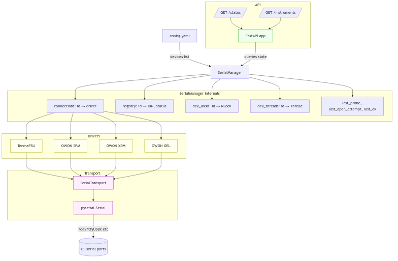
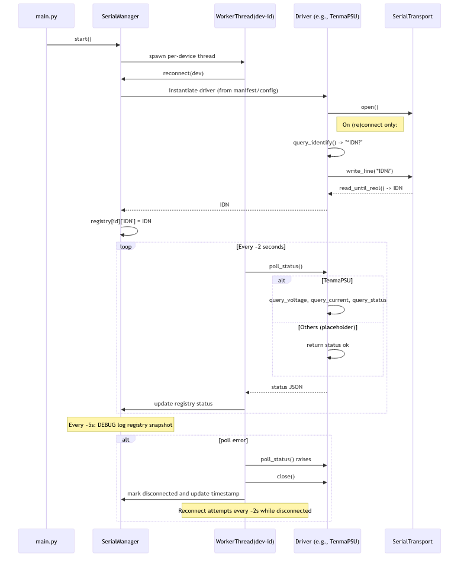

# Architecture

This document provides a comprehensive overview of BenchMesh's architecture, design decisions, and component interactions.

## System Overview

BenchMesh follows a layered architecture with clear separation of concerns:

```
┌─────────────────────────────────────────────────────────┐
│                   Browser (User Interface)              │
│                React + TypeScript + Vite                │
└───────────────┬────────────────────┬────────────────────┘
                │                    │
                │ HTTP/REST          │ WebSocket
                │                    │ (Real-time updates)
                ▼                    ▼
┌───────────────────────────────────────────────────────┐
│              FastAPI Backend Service                  │
│          (benchmesh-serial-service)                   │
│                                                       │
│  ┌─────────────────────────────────────────────────┐ │
│  │           SerialManager                         │ │
│  │  (Connection orchestration & device registry)  │ │
│  └───────┬──────────────────────────┬──────────────┘ │
│          │                          │                 │
│          │ Device Workers           │ Device Threads │
│          │ (per-device polling)     │ (concurrency)  │
│          ▼                          ▼                 │
│  ┌──────────────────────────────────────────────┐   │
│  │         Modular Driver Layer                 │   │
│  │  (tenma_72, owon_spm, owon_xdm, etc.)       │   │
│  └──────────────┬───────────────────────────────┘   │
│                 │                                     │
│                 │ Serial Commands                     │
│                 ▼                                     │
│  ┌──────────────────────────────────────────────┐   │
│  │         SerialTransport                      │   │
│  │  (pyserial abstraction with EOL handling)   │   │
│  └──────────────┬───────────────────────────────┘   │
└─────────────────┼───────────────────────────────────┘
                  │
                  ▼
         ┌────────────────────┐
         │  Physical Devices  │
         │  (/dev/ttyUSB*, COM*) │
         └────────────────────┘
```

## Core Components

### 1. FastAPI Backend Service

**Location**: `benchmesh-serial-service/src/benchmesh_service/`

The FastAPI application serves as the central hub, providing:
- RESTful API endpoints for device control
- WebSocket connections for real-time status updates
- Static file serving for the frontend
- API documentation via Swagger/OpenAPI

**Key files**:
- `api.py` - FastAPI application and route definitions
- Main routes include `/status`, `/instruments`, `/instruments/{class}/{id}/...`

### 2. SerialManager

**Location**: `serial_manager.py`

The SerialManager is the heart of BenchMesh's device management:

**Responsibilities**:
- Loads device configurations from `config.yaml`
- Resolves driver manifests and instantiates appropriate drivers
- Spawns and manages per-device worker threads
- Maintains the device registry (IDN and status data)
- Implements reconnection logic with exponential backoff
- Provides thread-safe access to devices via per-device locks

**Key data structures**:
```python
connections: dict[str, Driver]        # Active driver instances
registry: dict[str, dict]              # {IDN, status, metadata}
dev_locks: dict[str, RLock]           # Per-device thread locks
dev_threads: dict[str, Thread]        # Worker thread handles
```

### 3. Driver Layer

**Location**: `drivers/`

Each driver is a self-contained package that implements device-specific protocols:

**Required interface**:
- `query_identify()` - Returns device identification string (IDN)
- `poll_status()` - Returns current device status as JSON
- Device-specific methods following naming convention:
  - `query_*` methods for reading values
  - `set_*` methods for writing/controlling

**Driver structure**:
```
drivers/
├── tenma_72/
│   ├── __init__.py
│   ├── driver.py          # Driver implementation
│   └── manifest.json      # Models, classes, polling config
├── owon_spm/
│   ├── __init__.py
│   ├── driver.py
│   └── manifest.json
└── classes.json           # Device class definitions
```

**Manifest system**:
Each driver includes a `manifest.json` that defines:
- Supported models and their device classes (PSU, DMM, AWG, etc.)
- Per-class polling configuration (methods and intervals)
- Serial communication settings (EOL characters)
- Connection parameters

### 4. Transport Layer

**Location**: `transport.py`

The `SerialTransport` class provides a clean abstraction over pyserial:

**Features**:
- Automatic EOL character handling (send_eol, recv_eol)
- Connection management (open, close, reconnect)
- Read/write operations with timeout handling
- Thread-safe serial communication

**Usage**:
```python
transport = SerialTransport("/dev/ttyUSB0", 9600)
transport.open()
transport.write_line("*IDN?")
response = transport.read_until_reol()
```

### 5. Frontend UI

**Location**: `benchmesh-serial-service/frontend/`

**Technology stack**:
- React 18 with TypeScript
- Vite for build tooling
- React Query for state management
- WebSocket for real-time updates

**Key features**:
- Dashboard view with device status cards
- Configuration panel for device management
- Device-specific control interfaces (PSU, DMM, etc.)
- Real-time status updates via WebSocket

### 6. Node-RED Integration

**Location**: `node-red-contrib-benchmesh/`

Custom Node-RED nodes for automation:
- Device control nodes
- Status monitoring nodes
- Event-driven automation workflows

## Architecture Diagrams

### Component Interaction



### Per-Device Worker Behavior



## Design Decisions

### 1. Per-Device Worker Threads

**Decision**: Each device runs in its own dedicated thread.

**Rationale**:
- Isolates device failures (one device crash doesn't affect others)
- Simplifies polling logic (no complex async coordination)
- Natural fit for blocking serial I/O operations
- Easy to implement device-specific polling intervals

**Thread Safety**:
- Each device has a dedicated `RLock` for synchronized access
- Registry updates are protected by locks
- No shared mutable state between devices

### 2. Manifest-Driven Driver System

**Decision**: Drivers are configured via `manifest.json` files.

**Rationale**:
- Declarative configuration separates data from code
- Easy to add new device models without code changes
- Supports driver aliasing and model variations
- Centralized location for connection parameters

### 3. Secure API Method Resolution

**Decision**: API endpoints automatically resolve partial method names to `query_*` or `set_*` methods.

**Rationale**:
- Prevents arbitrary method execution (security)
- Clean, intuitive API URLs
- HTTP verb semantics (GET for queries, POST for setters)
- Protection against accidental method calls

**Example**:
- `GET /instruments/PSU/psu-1/1/voltage` → `driver.query_voltage(1)`
- `POST /instruments/PSU/psu-1/1/current/2.5` → `driver.set_current(1, 2.5)`

### 4. Automatic Reconnection

**Decision**: Devices automatically attempt reconnection on failure.

**Rationale**:
- Improves reliability for flaky connections
- Reduces manual intervention
- Graceful handling of device power cycles
- User-friendly experience (devices "just work")

**Implementation**:
- ~2 second backoff between reconnection attempts
- Tracks last connection attempt timestamp
- Preserves device configuration across reconnections

### 5. Registry Data Model

**Decision**: Central registry stores IDN and status for all devices.

**Rationale**:
- Single source of truth for device state
- Efficient API queries (no device polling on every request)
- WebSocket updates driven by registry changes
- Historical context for debugging

**Registry structure**:
```python
{
  "device-id": {
    "IDN": "TENMA 72-2540 V2.1",
    "status": {
      "voltage": 12.0,
      "current": 0.5,
      "output": "ON"
    },
    "class": "PSU",
    "connected": true
  }
}
```

## Concurrency Model

### Thread Architecture

```
Main Thread
├── FastAPI Server (handles HTTP/WebSocket)
├── DeviceWorker Thread 1 (device-1)
├── DeviceWorker Thread 2 (device-2)
├── DeviceWorker Thread 3 (device-3)
└── ...
```

### Synchronization

- **Per-device locks**: Each device has an `RLock` preventing concurrent access
- **Registry access**: Thread-safe dict operations
- **Connection management**: Protected by device-specific locks

### Error Handling

Worker threads implement try-except blocks:
1. Poll device status
2. On error: close connection, mark device as disconnected
3. Retry connection after backoff period
4. Log errors for debugging

## Configuration System

### config.yaml Structure

```yaml
version: 1
devices:
  - id: psu-1                    # Unique identifier
    name: "TENMA PSU"            # Display name
    driver: tenma_72             # Driver package name
    port: /dev/ttyUSB0           # Serial port
    baud: 9600                   # Baud rate
    serial: 8N1                  # Data/parity/stop bits
    model: 72-2540               # Optional model override
```

### Driver Manifest Structure

```json
{
  "models": {
    "72-2540": {
      "class": "PSU",
      "description": "TENMA 72-2540 Power Supply"
    }
  },
  "classes": {
    "PSU": {
      "polling": {
        "methods": ["poll_status"],
        "interval": 2.0
      }
    }
  },
  "connection": {
    "send_eol": "\r\n",
    "recv_eol": "\r\n"
  }
}
```

## API Design

### RESTful Endpoints

- `GET /status` - Overall system status (connected/total counts)
- `GET /instruments` - List all configured devices with metadata
- `GET /instruments/{class}/{id}/{channel}/{parameter}` - Query device value
- `POST /instruments/{class}/{id}/{channel}/{parameter}/{value}` - Set device value
- `WS /ws` - WebSocket for real-time updates

### Method Resolution

The API implements smart method resolution:

1. **Extract partial method name** from URL path
2. **Apply prefix** based on HTTP verb (GET → `query_`, POST → `set_`)
3. **Validate method exists** on driver
4. **Reject private methods** (starting with `_`)
5. **Execute with parameters** from URL path

This provides security while maintaining clean URLs.

## Performance Considerations

### Polling Intervals

- Default: 2 seconds per device
- Configurable per device class in manifest
- Balance between responsiveness and CPU usage

### WebSocket Updates

- Broadcast only on status changes
- Throttle update frequency to prevent flooding
- Efficient JSON serialization

### Memory Usage

- Minimal state stored in registry
- Driver instances are lightweight
- No historical data retention (use external logging)

## Extensibility

### Adding New Drivers

1. Create driver package in `drivers/`
2. Implement required methods (`query_identify`, `poll_status`)
3. Create `manifest.json` with model/class definitions
4. Add tests in `tests/`
5. Update documentation

See [Driver Development Guide](Driver-Development) for details.

### Custom Frontends

The API is fully accessible via HTTP/REST:
- Build custom UIs in any framework
- Integrate with external systems
- Automation via shell scripts or other tools

### Automation

- Node-RED for visual programming
- Direct API access for scripting
- WebSocket for event-driven automation

## Future Architecture Considerations

### Potential Enhancements

1. **Database integration** - Persistent storage of device history
2. **Plugin system** - Dynamic driver loading without restart
3. **Multi-user support** - Authentication and authorization
4. **Device groups** - Coordinated control of related devices
5. **MQTT integration** - Pub/sub messaging for IoT ecosystems

These enhancements would require careful design to maintain simplicity and reliability.

## Related Documentation

- [Configuration Guide](Configuration) - Device and system configuration
- [Driver Development](Driver-Development) - Creating new drivers
- [API Reference](API-Reference) - Complete API documentation
- [Testing Guide](Testing) - Running and writing tests
